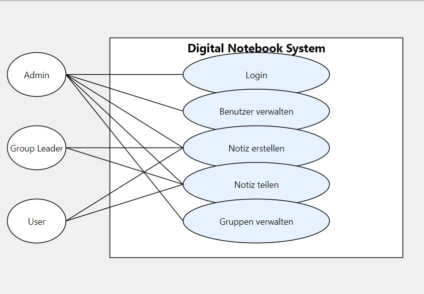
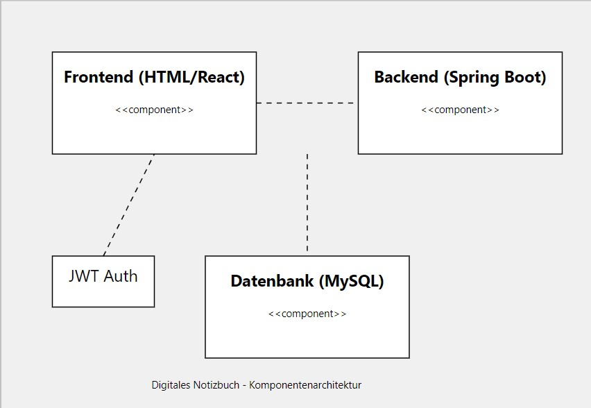

# Projektmanagement Use Cases

Class: Softwareentwicklung
Type: Blended Learning

### Use-Case: Digitales Notizbuch für Mitarbeiter

### 1. **Use-Case-Titel:**

Digitales Notizbuch für Mitarbeiter

### Use Cases:

### 2. **Ziel:**

Verbesserung der Effizienz und Zusammenarbeit der Mitarbeiter durch eine zentrale Plattform für persönliche und teambezogene Notizen.

### 3. **Akteure:**

- **Mitarbeiter:** Nutzen das Notizbuch, um persönliche Notizen zu erstellen und Informationen zu Projekten und Gruppen zu teilen.
- **Teamleiter:** Verwenden das Notizbuch, um Projektfortschritte zu dokumentieren und Informationen mit dem Team zu teilen.
- **IT-Administratoren:** Verantwortlich für die Integration des Notizbuchs in die bestehende IT-Infrastruktur und die Verwaltung der Zugriffsrechte.

### 4. **Voraussetzungen:**

- Mitarbeiter haben Zugang zu einem Gerät mit Internetverbindung.
- Die bestehende IT-Infrastruktur unterstützt die Integration des Notizbuchs.
- Mitarbeiter haben die nötigen Anmeldedaten für den Zugang.

### 5. **Beschreibung:**

Das digitale Notizbuch ermöglicht Mitarbeitern, ihre persönlichen Notizen zu speichern und zu organisieren, sowie Notizen zu Projekten und Gruppen zu erstellen und zu teilen. Die Anwendung soll eine benutzerfreundliche Oberfläche bieten, die folgende Funktionen unterstützt:

- **Erstellen von Notizen:** Benutzer können Textnotizen, To-Do-Listen und Links einfügen.
- **Kategorisieren von Notizen:** Benutzer können Notizen nach Projekten oder Gruppen sortieren.
- **Kollaboration:** Benutzer können Notizen mit Kollegen teilen, Kommentare hinzufügen und gemeinsam an Notizen arbeiten.
- **Suchfunktion:** Benutzer können nach Stichworten in Notizen suchen.
- **Integration mit bestehenden Tools:** Das Notizbuch sollte mit anderen Tools wie E-Mail, Kalender und Projektmanagement-Software kompatibel sein.
- **Zugriffsrechte:** IT-Administratoren können Benutzerrechte verwalten, um den Zugriff auf bestimmte Notizen oder Projekte zu steuern.

### 6. **Ablauf:**

- **Hauptablauf:**
    1. Der Mitarbeiter loggt sich in das digitale Notizbuch ein.
    2. Der Mitarbeiter erstellt eine neue Notiz (persönlich oder projektbezogen).
    3. Der Mitarbeiter kategorisiert die Notiz und fügt Tags hinzu.
    4. Der Mitarbeiter kann die Notiz mit Kollegen teilen.
    5. Kollegen können die Notiz einsehen, Kommentare hinzufügen oder gemeinsam bearbeiten.
    6. Der Mitarbeiter kann die Notiz jederzeit aktualisieren oder löschen.
- **Alternativablauf:**
    - **Zugriffsproblem:** Wenn ein Mitarbeiter versucht, auf eine Notiz zuzugreifen, für die er keine Berechtigung hat, erhält er eine entsprechende Fehlermeldung.

### 7. **Erwartete Ergebnisse:**

- Zentrale Speicherung und einfacher Zugriff auf Notizen.
- Verbesserung der Zusammenarbeit durch die Möglichkeit, Informationen in Echtzeit zu teilen.
- Erhöhung der Produktivität durch reduzierte Suchzeiten und bessere Organisation von Informationen.

### 8. **Messbare Indikatoren:**

- Anzahl der erstellten Notizen pro Mitarbeiter pro Woche.
- Häufigkeit der Nutzung der Kollaborationsfunktionen (Kommentare, gemeinsame Bearbeitung).
- Mitarbeiterzufriedenheit und Feedback zu Effizienzsteigerungen.

## User Stories

**User Story 1 (Admin):**

> "Als Admin möchte ich Benutzer verwalten können, um sicherzustellen, dass nur autorisierte Personen Zugriff auf das System und die relevanten Gruppen haben."
> 

**Akzeptanzkriterien:**

- Der Admin kann Benutzer hinzufügen und löschen.
- Der Admin kann Benutzerrollen ändern (User, Group Leader).
- Der Admin kann Passwörter zurücksetzen.

---

**User Story 2 (Group Leader):**

> "Als Group Leader möchte ich Notizen mit meiner Gruppe teilen können, um sicherzustellen, dass alle Gruppenmitglieder die nötigen Informationen haben."
> 

**Akzeptanzkriterien:**

- Der Group Leader kann Notizen einer Gruppe zuweisen.
- Der Group Leader kann bestehende Notizen bearbeiten und löschen.
- Die Gruppenmitglieder können die geteilten Notizen lesen.

## UML-Diagramm

## Datenbank ERP
Entitäten und Attribute
Benutzer (User)

UserID (Primärschlüssel)
Benutzername
Passwort (verschlüsselt)
Rolle (Admin, Group Leader, User)
Erstelldatum
Gruppe (Group)

GroupID (Primärschlüssel)
Gruppenname
Beschreibung
Erstelldatum
Notiz (Note)

NoteID (Primärschlüssel)
Titel
Inhalt
Erstellungsdatum
Aktualisierungsdatum
Ersteller (Fremdschlüssel → UserID)
Sichtbarkeit (persönlich oder geteilt mit einer Gruppe)
Gruppenmitgliedschaft (GroupMembership)

MembershipID (Primärschlüssel)
GroupID (Fremdschlüssel → GroupID)
UserID (Fremdschlüssel → UserID)
Beitrittsdatum
Rolle innerhalb der Gruppe (Member, Group Leader)
Notizen teilen (NoteSharing)

ShareID (Primärschlüssel)
NoteID (Fremdschlüssel → NoteID)
GroupID (Fremdschlüssel → GroupID)

